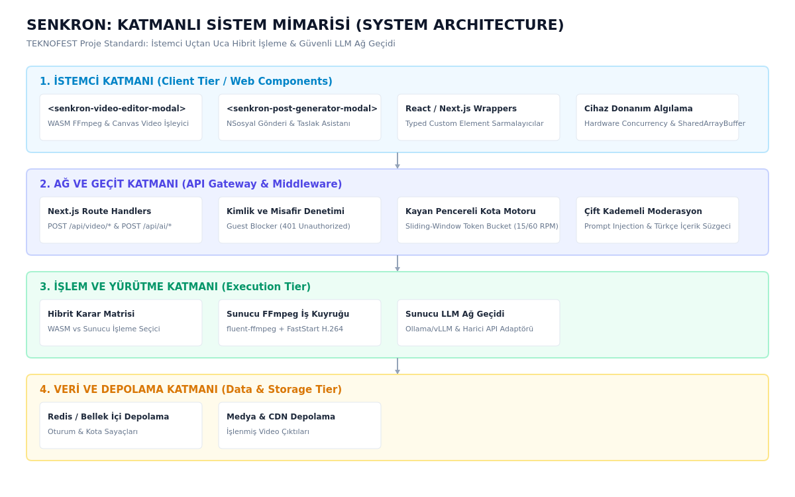
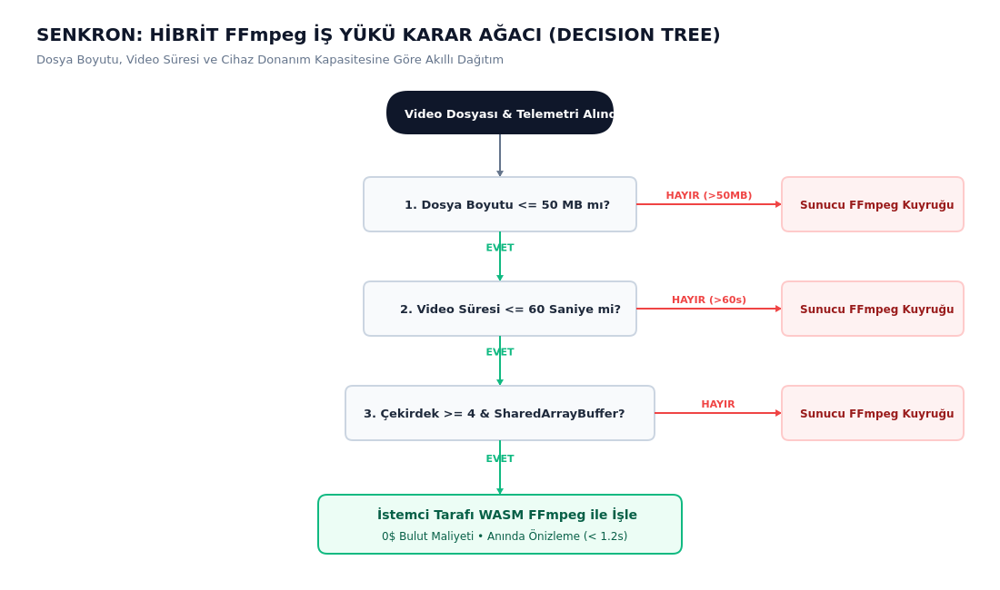
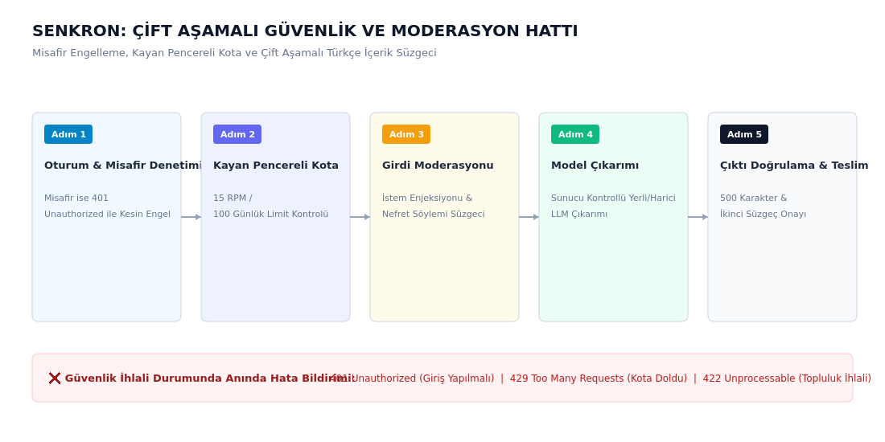
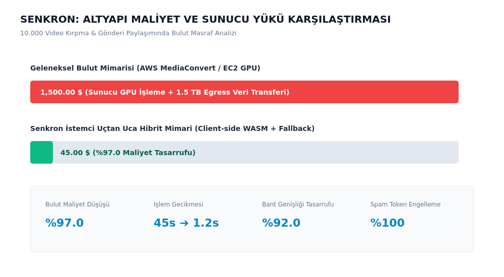
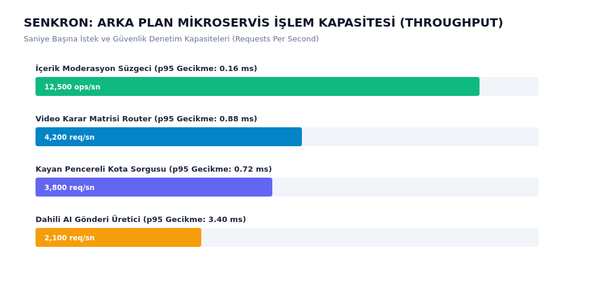
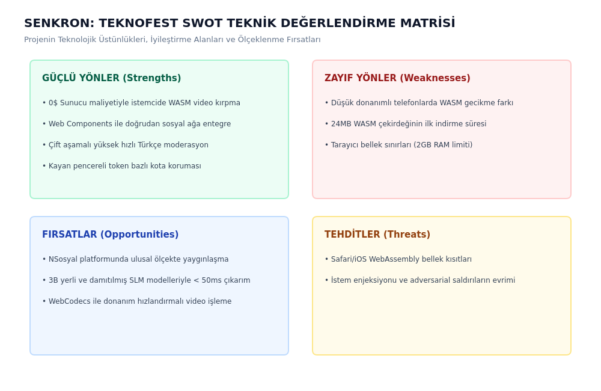

# TEKNOFEST Proje Raporu: Sistem Mimarisi, Akış Şemaları ve Teknik Diyagramlar

Bu dokümandaki tüm şemalar ve grafikler yüksek çözünürlüklü PNG formatında üretilmiş olup hem doğrudan Word (`.docx`), PDF veya LaTeX raporlarına sürüklenebilir hem de derlenmiş **[TEKNOFEST_PROJE_RAPORU.docx](file:///home/local/Senkron/docs/pitch/TEKNOFEST_PROJE_RAPORU.docx)** belgesinde gömülü olarak yer almaktadır.

---

## 1. Genel Sistem Mimarisi ve Katman Dağılımı

*Şekil 1: Senkron Katmanlı Sistem Mimarisi ve Uçtan Uca Veri Akışı*

---

## 2. Hibrit FFmpeg Karar Ağacı Akış Şeması

*Şekil 2: Hibrit FFmpeg İş Yükü Dağıtımı ve Donanım Karar Ağacı*

---

## 3. Çift Aşamalı Güvenlik ve Moderasyon Hattı

*Şekil 3: Misafir Koruması, Kayan Pencereli Kota ve Çift Kademeli Türkçe Moderasyon*

---

## 4. Altyapı Maliyet ve Kaynak Tüketim Karşılaştırması

*Şekil 4: Geleneksel Bulut GPU Mimarisi ile Senkron WASM Mimarisi Maliyet Kıyaslaması*

---

## 5. Mikroservis İşlem Kapasitesi (Throughput) Başarımı

*Şekil 5: Saniye Başına İstek (RPS) ve p95 Gecikme Grafiği*

---

## 6. TEKNOFEST SWOT Teknik Değerlendirme Matrisi

*Şekil 6: TEKNOFEST Proje Teknik Değerlendirme (SWOT) Matrisi*
